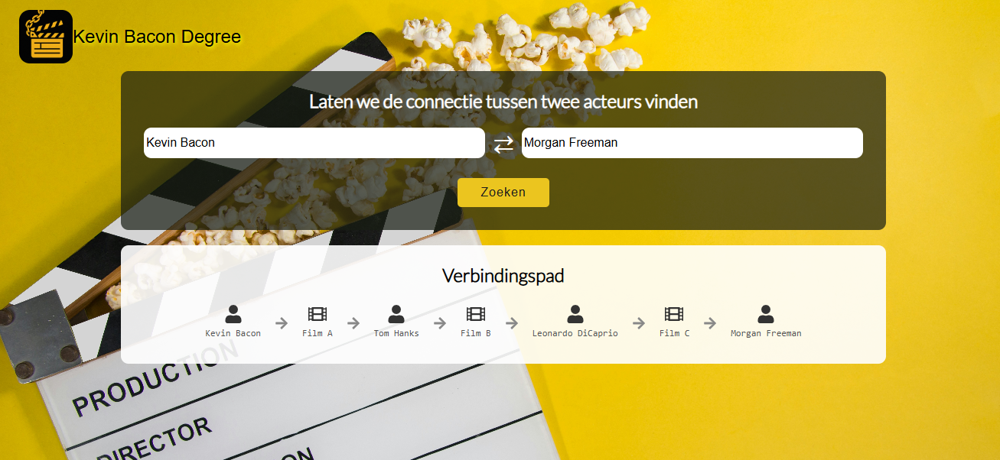

# 🎬 Kevin Bacon Degree Applicatie

> _"Er wordt gezegd dat je van de ene filmacteur naar een andere kunt gaan via maximaal zes connecties op basis van films waarin ze samen hebben gespeeld. Dit wordt ook wel de Kevin Bacon Degree genoemd. Denk je dat dit klopt? Wil je het uitproberen? Dan is deze applicatie echt iets voor jou! Kies gewoon twee acteurs uit de vakjes en bekijk het resultaat. Veel succes!"_

---



<pre> ## 📁 Proje Dosya Yapısı ``` 📦 proje-kök-klasörü ├── 📁 public │ └── 📄 vite.svg └── 📁 src ├── 📄 App.css ├── 📄 App.jsx ├── 📄 index.css ├── 📄 main.jsx ├── 📁 api │ ├── 📄 actors.js │ ├── 📄 connections.js │ └── 📄 getActorANdMovie.js ├── 📁 assets │ ├── 🖼️ back.jpg │ ├── 🖼️ kevinapp.PNG │ ├── 🖼️ logo.png │ ├── 🖼️ logo2.png │ └── 🖼️ react.svg ├── 📁 components │ ├── 📄 ConnectionCard.jsx │ ├── 📄 ConnectionCards.jsx │ ├── 📄 Layout.jsx │ └── 📄 Navbar.jsx ├── 📁 hooks │ ├── 📄 useActorById.js │ ├── 📄 useActors.js │ ├── 📄 useConnections.js │ └── 📄 useMovieById.js ├── 📁 pages │ ├── 📄 AboutPage.jsx │ └── 📄 HomePage.jsx └── 📁 routes └── 📄 router.jsx ``` </pre>
